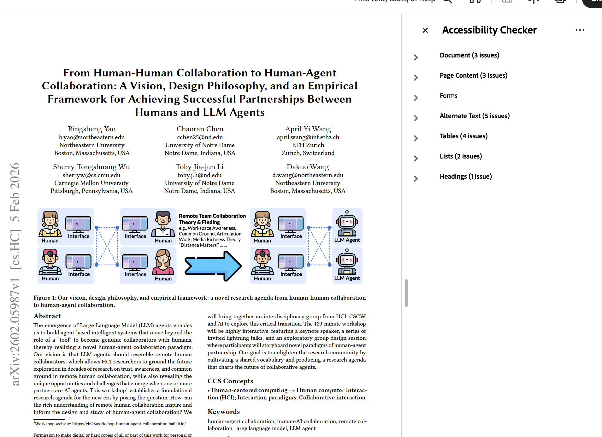

# PDF Accessibility Toolkit

Convert scanned or inaccessible PDFs into Word documents with stronger accessibility support for higher-ed workflows.

This skill is designed to fill a practical gap: large files, large batches, and complex document structures (especially tables and images) that are hard to remediate reliably with general chat tools alone.

NotebookLM, ChatGPT, and similar platforms can be useful for smaller, simpler PDFs, but they are not optimized for high-volume conversion workflows or consistent handling of complex layouts across many files. This toolkit provides a repeatable pipeline for those harder cases.

For institutions handling FERPA-protected documents, the same workflow can be adapted to use an enterprise-approved model provider instead of Mistral (for example, AWS-hosted OCR models under an institutional agreement) by swapping the model API integration in the scripts.

This repository is skill-first: the primary distribution is the Codex skill package at `skills/codex/higher-ed-pdf-accessibility`.

## Requirements

You need:
- Python 3.8+
- `uv` (required for the shell runner scripts)
- A Mistral API key
- Local file access to your PDFs

Create your `.env` file with:

```env
MISTRAL_API_KEY=your_key_here
```

`.env` lookup order (used by the scripts):
1. Path passed with `--env-file`
2. Input PDF folder (for example, `work/input/.env`)
3. Current working directory
4. Skill-local `.env`
5. Existing shell environment variable `MISTRAL_API_KEY`

## Easiest Setup In Codex (No GitHub Commands)

Use this if you are comfortable with Codex but do not want to use `git` commands.

1. Create a working folder on your computer.
2. Put your PDF files in that folder.
3. In that same folder, create a file named `.env` with:

```env
MISTRAL_API_KEY=your_key_here
```

4. Open Codex with that working folder as the current folder/workspace.
5. Paste this prompt to install the skill from GitHub:

```text
Install the Codex skill from:
https://github.com/Brehove/pdf-accessibility-toolkit
Use this skill path:
skills/codex/higher-ed-pdf-accessibility
```

6. Then paste this prompt to run conversion in the current folder:

```text
Use the higher-ed-pdf-accessibility skill to batch-convert all PDFs in this current folder.
Use the .env file in this folder for MISTRAL_API_KEY.
```

7. If Codex says the new skill is not loaded yet, restart Codex once and run step 6 again.

## Install The Skill

### Recommended: install from GitHub

```bash
CODEX_HOME="${CODEX_HOME:-$HOME/.codex}" python3 "$HOME/.codex/skills/.system/skill-installer/scripts/install-skill-from-github.py" --repo Brehove/pdf-accessibility-toolkit --path skills/codex/higher-ed-pdf-accessibility
```

Restart Codex after install so the new skill is loaded.

### Alternative: install from a local clone

```bash
git clone https://github.com/Brehove/pdf-accessibility-toolkit.git
cd pdf-accessibility-toolkit
mkdir -p "${CODEX_HOME:-$HOME/.codex}/skills"
cp -R skills/codex/higher-ed-pdf-accessibility "${CODEX_HOME:-$HOME/.codex}/skills/"
```

## Run The Workflow

### In Codex (primary)

Ask Codex to use `higher-ed-pdf-accessibility` on your folder.

Example intent:
- "Use the accessibility skill to batch convert PDFs in `work/input`."

### From terminal (same skill scripts)

Set the installed skill directory:

```bash
SKILL_DIR="${CODEX_HOME:-$HOME/.codex}/skills/higher-ed-pdf-accessibility"
```

Run isolated batch conversion (recommended):

```bash
"$SKILL_DIR/scripts/convert_pdfs_isolated.sh" work/input
```

What this does:
- Processes each PDF in its own folder (prevents image filename collisions)
- Runs OCR -> DOCX conversion -> table-header verification per file

Optional legacy shared-output flow (not recommended):

```bash
uv run --with mistralai --with python-dotenv --with python-docx \
  python3 "$SKILL_DIR/scripts/mistral_ocr_batch.py" --input-dir work/input --output-dir work/output

uv run --with mistralai --with python-dotenv --with python-docx \
  python3 "$SKILL_DIR/scripts/md_to_accessible_docx.py" work/output/*.md
```

## Outputs

Output root:
- `work/input/conversion_runs/`

Per-PDF output folder:
- `work/input/conversion_runs/<pdf-stem>/`

Typical files per PDF:
- `<name>.pdf` (copied source)
- `<name>.md`
- `<name>.docx`
- `<name>_accessible.docx`
- extracted images (if present)

## Before/After Examples

Before (source PDF in Acrobat with accessibility issues):



After (converted DOCX in Word accessibility assistant):


## Repository Layout

Primary skill package:
- `skills/codex/higher-ed-pdf-accessibility/SKILL.md`
- `skills/codex/higher-ed-pdf-accessibility/scripts/`
- `skills/codex/higher-ed-pdf-accessibility/references/`
- `skills/codex/higher-ed-pdf-accessibility/agents/`

Shared documentation:
- `docs/qa-checklist.md`
- `docs/alt-text-guidance.md`
- `docs/long-document-handling.md`

## Script Reference (Skill Package)

- `skills/codex/higher-ed-pdf-accessibility/scripts/mistral_ocr_batch.py`
  - Converts PDF pages to Markdown via Mistral OCR
- `skills/codex/higher-ed-pdf-accessibility/scripts/md_to_accessible_docx.py`
  - Converts Markdown structure into accessible Word structure
- `skills/codex/higher-ed-pdf-accessibility/scripts/fix_docx_table_headers.py`
  - Ensures table headers are marked for assistive technologies
- `skills/codex/higher-ed-pdf-accessibility/scripts/convert_pdfs_isolated.sh`
  - Orchestrates the full pipeline one PDF per folder

## Accessibility QA (Required)

Automated conversion is not sufficient for publishing to students. Documents should be manually verified.

Use:
- `docs/qa-checklist.md`
- `docs/alt-text-guidance.md`
- `docs/long-document-handling.md`

Minimum manual checks:
- Heading hierarchy is logical
- Table headers are correct
- Alt text quality is meaningful
- Reading order is understandable

## Troubleshooting

Common issues:
- `MISTRAL_API_KEY environment variable not set`
  - Verify `.env` location or pass `--env-file`.
- `No PDFs found`
  - Confirm files end in `.pdf`/`.PDF` and are in the expected input folder.
- API/network failures
  - Re-run failed files individually; long documents may need retries.

## Notes and Limits

- OCR quality controls output quality.
- Complex layouts (dense math, multi-column pages, complex tables) still need manual review.
- This tool accelerates remediation; it does not replace human accessibility review.

## License

MIT. See `LICENSE`.
